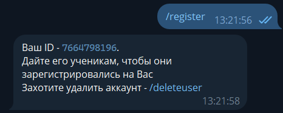

# Python Tasks Bot

<!-- TOC -->
* [Python Tasks Bot](#python-tasks-bot)
  * [What is it?](#what-is-it)
  * [What can it do?](#what-can-it-do)
    * [Teacher capabilities](#teacher-capabilities)
    * [Student capabilities](#student-capabilities)
<!-- TOC -->

## What is it?
This project is a Telegram bot created in Python. It is used for learning.

## What can it do?
There is a teacher and some students (or just one). Each of them has its own capabilities.

### Teacher capabilities

Teacher can create a teacher account in the bot.
Then he must give this ID to his students (this is no longer done through the bot).

### Student capabilities
